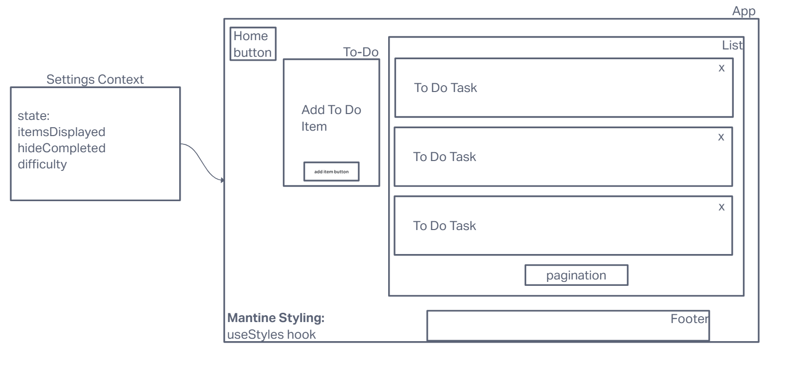

# LAB - Class 31 / 32 / 33 / 34

## Project: Context API

### Author: Ike Steoger

### Problem Domain

- In Phase 1, we’re going to perform some refactoring of a Todo application built by another team. This application mixes application state and user settings at the top level and passes things around. It was a good proof of concept, but we need to make this production ready.

### Links and Resources

- [GitHub Actions ci/cd](https://github.com/ikesteoger/todo-app/actions)
<!-- - [back-end server url](http://xyz.com) (when applicable) -->
<!-- - [front-end application]() -->

### Collaborators

Ryan Gallaway
Reece Renninger
Josh Coffey
<!-- Nick Mullaney
Kaeden O'meara
Ryan Eastman -->

### Setup

<!-- #### `.env` requirements

For now I have none and do not require one -->

#### How to initialize/run your application

- Run `npm i` and then `npm start`

<!--- #### How to use your library (where applicable) --->

#### Features / Routes

- A website that can use REST functions on any API that you put a link in for.
<!-- - GET : `/hello` - specific route to hit -->

#### Tests

- Run `npm test` to see tests running.

#### UMLs

