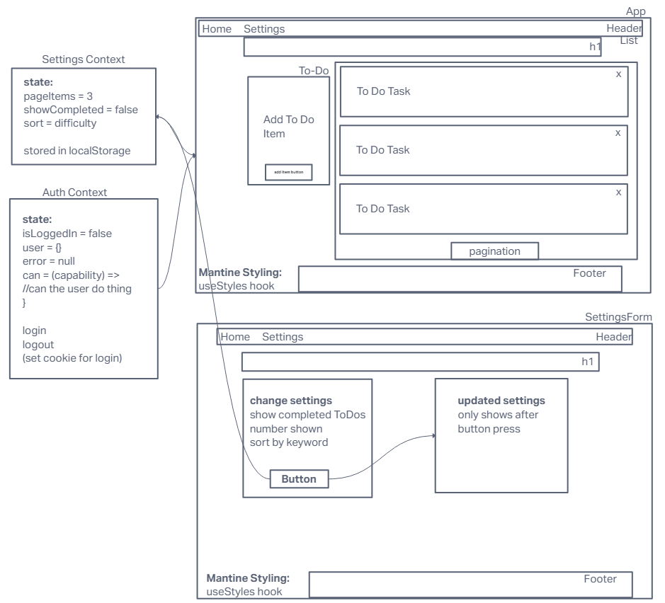
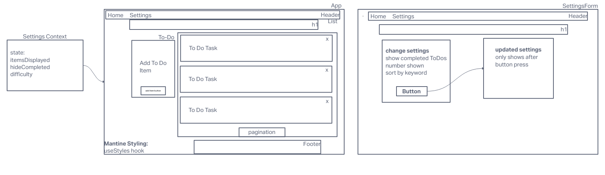
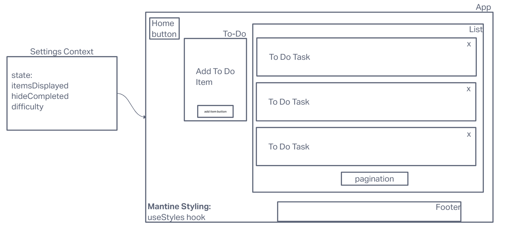

# LAB - Class 31 / 32 / 33 / 34

## Project: Context API & Context API Behaviors with Authorization

### Author: Ike Steoger

### Problem Domain

- In Phase 1, we’re going to perform some refactoring of a Todo application built by another team. This application mixes application state and user settings at the top level and passes things around. It was a good proof of concept, but we need to make this production ready.
- In Phase 2, we’re going to extend the functionality of our application by allowing the user to make some decisions on how they would like the application to function. Specifically, we’ll let them make changes to 2 settings. Implement the Context API to make some basic application settings available to components. Provide the users with a form where they can change the values for those settings. Save the users choices in Local Storage. Retrieve their preferences from Local Storage and apply them to the application on startup.
- In Phase 3, we’d like to extend the functionality of the application by requiring users be logged in to view items and also restrict access based on user type. The user stories from Phases 1, and 2 remain unchanged. For this phase, we are now adding the following new user stories.

> - As a user, I want to provide a way for other users to create new accounts.
> - As a user, I want to provide a way for all users to login to their account.
> - As a user, I want to make sure that my To Do items are only viewable to users that have logged in with a valid account.
> - As a user, I want to ensure that only fellow users that are allowed to “create”, based on their user type, can add new To Do Items.
> - As a user, I want to ensure that only fellow users that are allowed to “update”, based on their user type, can mark To Do Items complete.
> - As a user, I want to ensure that only fellow users that are allowed to “delete”, based on their user type, can delete new To Do Items.

### Links and Resources

- [GitHub Actions ci/cd](https://github.com/ikesteoger/todo-app/actions)
<!-- - [back-end server url](http://xyz.com) (when applicable) -->
- [front-end application](https://codesandbox.io/p/github/IkeSteoger/todo-app/main?layout=%257B%2522sidebarPanel%2522%253A%2522EXPLORER%2522%252C%2522rootPanelGroup%2522%253A%257B%2522direction%2522%253A%2522horizontal%2522%252C%2522type%2522%253A%2522PANEL_GROUP%2522%252C%2522id%2522%253A%2522ROOT_LAYOUT%2522%252C%2522panels%2522%253A%255B%257B%2522type%2522%253A%2522PANEL_GROUP%2522%252C%2522direction%2522%253A%2522horizontal%2522%252C%2522id%2522%253A%2522EDITOR%2522%252C%2522panels%2522%253A%255B%257B%2522type%2522%253A%2522PANEL%2522%252C%2522panelType%2522%253A%2522TABS%2522%252C%2522id%2522%253A%2522cljf0e5tz000b356myzo7l5m1%2522%257D%255D%252C%2522sizes%2522%253A%255B100%255D%257D%252C%257B%2522type%2522%253A%2522PANEL_GROUP%2522%252C%2522direction%2522%253A%2522horizontal%2522%252C%2522id%2522%253A%2522DEVTOOLS%2522%252C%2522panels%2522%253A%255B%257B%2522type%2522%253A%2522PANEL%2522%252C%2522panelType%2522%253A%2522TABS%2522%252C%2522id%2522%253A%2522cljf0e5tz000d356m618nm7q1%2522%257D%255D%252C%2522sizes%2522%253A%255B100%255D%257D%255D%252C%2522sizes%2522%253A%255B50%252C50%255D%257D%252C%2522tabbedPanels%2522%253A%257B%2522cljf0e5tz000b356myzo7l5m1%2522%253A%257B%2522tabs%2522%253A%255B%257B%2522id%2522%253A%2522cljf0e5ty000a356moe8qjxbv%2522%252C%2522mode%2522%253A%2522permanent%2522%252C%2522type%2522%253A%2522FILE%2522%252C%2522filepath%2522%253A%2522%252FREADME.md%2522%257D%255D%252C%2522id%2522%253A%2522cljf0e5tz000b356myzo7l5m1%2522%252C%2522activeTabId%2522%253A%2522cljf0e5ty000a356moe8qjxbv%2522%257D%252C%2522cljf0e5tz000d356m618nm7q1%2522%253A%257B%2522id%2522%253A%2522cljf0e5tz000d356m618nm7q1%2522%252C%2522tabs%2522%253A%255B%257B%2522type%2522%253A%2522TASK_LOG%2522%252C%2522taskId%2522%253A%2522start%2522%252C%2522id%2522%253A%2522cljf0f19i00be356miu24o0it%2522%252C%2522mode%2522%253A%2522permanent%2522%257D%255D%252C%2522activeTabId%2522%253A%2522cljf0f19i00be356miu24o0it%2522%257D%257D%252C%2522showDevtools%2522%253Atrue%252C%2522showSidebar%2522%253Atrue%252C%2522sidebarPanelSize%2522%253A15%257D)

### Collaborators

Ryan Gallaway  
Reece Renninger  
Kaeden O'meara  
Nick Mullaney  
Ryan Eastman  
Josh Coffey  
Francisco Sanchez  

### Setup

<!-- #### `.env` requirements

For now I have none and do not require one -->

#### How to initialize/run your application

- Run `npm i` and then `npm start`

<!--- #### How to use your library (where applicable) --->

#### Features / Routes

- A interactive To Do list using Context API, localStorage, and authorization.
<!-- - GET : `/hello` - specific route to hit -->

#### Tests

- Run `npm test` to see tests running.

#### UMLs

##### UML Lab 33

##### UML Lab 32

##### UML Lab 31

